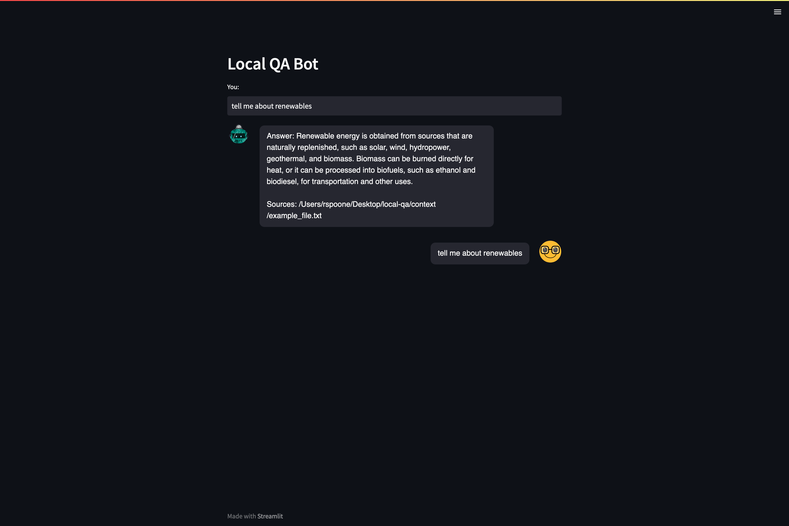

# Local Files Question-Answering

🤖 Ask questions in natural language to your local text files 🤖

💪 Built with [LangChain](https://github.com/hwchase17/langchain), Based on [Notion Question-Answering](https://github.com/hwchase17/notion-qa)



## 🌲 Environment Setup

1. Install the required packages:

```bash
pip install -r requirements.txt
```

2. Create a .env file in the root directory and set your OpenAI API key there. If you don't have one, get one [here](https://beta.openai.com/signup/):

```bash
OPENAI_API_KEY=....
```

## 📚 What's Inside?

- Example text files for context
- Python script to ask questions based on local text files
- Streamlit deployment code
- Instructions for using your own dataset

## 📊 Example Data

Example text files are provided as context. Replace them with your own text files to query your specific data.

## 💬 Ask a question

1. Run the Streamlit app:

```bash
streamlit run main.py
```

1. The Streamlit interface will open, where you can ask questions and get answers based on the ingested text files.

## 🚀 Deploy on Streamlit

The main.py file contains the code to run the Streamlit app. Use the command mentioned above to start the chat interface.

## 🧑 Use Your Own Dataset

1. Add your text files to the context folder.
1. Update config.json to include the appropriate file types and extensions for your dataset.
1. Ingest the data:

```bash
python ingest.py
```

1. Run the Streamlit app to ask questions based on your dataset:

```bash
streamlit run main.py
```

## 🌍 Using OpenAI as a Backup

If the local files don't have the answer to a specific question, the code will automatically use the OpenAI API as a backup to provide a relevant response. Make sure you have set your OpenAI API key in the .env file as mentioned in the Environment Setup section.

## File Tree

```text
📦local-qa
 ┣ 📂context                  # Directory containing the text files to be ingested
 ┃ ┣ 📜file1.txt
 ┃ ┣ 📜file2.txt
 ┃ ┣ 📜file3.txt
 ┃ ┗ 📜file4.txt
 ┣ 📜.env                     # Environment variables for the project (keep private)
 ┣ 📜.env.example             # Example environment variables file
 ┣ 📂.vscode                  # (optional) VSCode settings for the project
 ┃ └── ...
 ┣ 📜README.md                # Project documentation
 ┣ 📜config.json              # Configuration file for file types and extensions
 ┣ 📜docs.index               # Precomputed FAISS index file for text search
 ┣ 📜faiss_store.pkl          # Pickled FAISS store with document embeddings and metadata
 ┣ 📜ingest.py                # Script to ingest text files and create embeddings
 ┣ 📜main.py                  # Script to run the Q&A bot using Streamlit
 ┗ 📜requirements.txt         # List of required Python packages for the project
```
